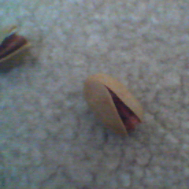
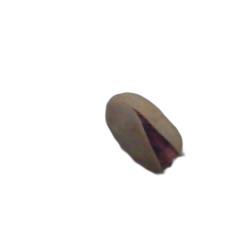
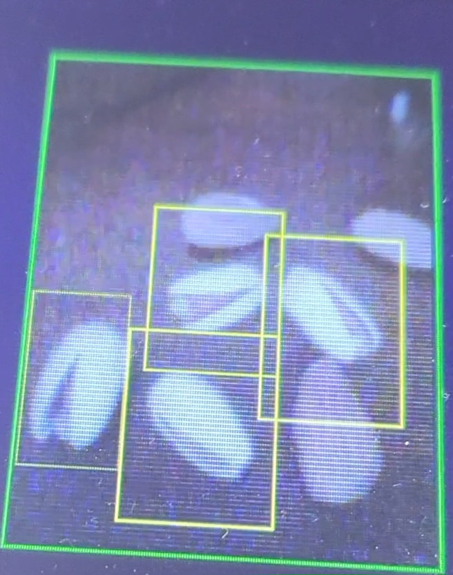

# Overview

This demo project locates "bad almonds" in camera images.

# Dataset

You need annotated images of good and bad almonds to create a dataset. A sample script is provided in the **utility** folder. It randomly selects good and bad almonds and places them in random locations in the background and generates the bounding box locations in csv files.

The following steps summarize the process:

1- Collect individual images of good and bad almonds with the original background removed and place them in the corresponding folders. 

To remove the original background, you can use **rembg** package (https://pypi.org/project/rembg/):





2- Use `create_dateset_almond.py` script to generate the dataset:

Make sure to update the path to good and bad almonds and background, and adjust other parameters as needed:

```python

# folder with good and bad almond pictures with no background
good_path = "almonds"
bad_path = "pistachio"
background_train = os.path.join("background_all")
background_test = os.path.join("background_all")

# number of good and bad objects per image
max_num_good_almonds = 3  # max number of good almonds in an image
max_num_bad_almonds = 3  # max number of bad almonds in an image

# size of dataset including training and test
total_size = 30000
```

3- Once completed, an "ALMOND" dataset folder is generated which includes train and test images and csv files with bounding box locations for each image. A zipped dataset file is also generated.


Currently, a limited set of plain dark and light background images is used to train the model. 

A public background image repo with MIT license is here and may also be used: (https://github.com/JizhiziLi/GFM)


# Training and Synthesis Tools

Install the training and synthesis tools as described in [ai8x-training/README.md at develop · MaximIntegratedAI/ai8x-training (github.com)](https://github.com/MaximIntegratedAI/ai8x-training/blob/develop/README.md)


## Almond Detection Model and Scripts

The model, dataloader and scripts for this project are located in `almond_detection_demo\train_synth_scripts`. You can copy them over ai8x-training and ai8x_synthesis tools folders.

Also, copy the "ALMOND" dataset to `ai8x-training/data`. 

**Training:** 

```bash
(ai8x-training) $ ./scripts/train_almond_tinierssdface_168_224.sh
```

**Quantization:** 

Make sure to update the `quantize_almond_tinierssd_168_244.sh` script with path to the checkpoint and the destination for the quantized checkpoint.

```bash
(ai8x-synthesis) $  ./scripts/quantize_almond_tinierssd_168_244.sh
```

**Evaluation:** 

Make sure to update the path to the quantized checkpoint in the script.

```bash
(ai8x-training) $ ./scripts/evaluate_almond_tinierssdface_168_224.sh
```

**Synthesis:**

Make sure to update the path to the quantized checkpoint and the prefix with the project name in the script.

```bash
(ai8x-synthesis) $   ./gen-demos-almond-tinierssdface_168_224_SDK_Almond.sh
```

The Known Answer Test (KAT) code will be generated in `sdk/Examples/MAX78000/CNN`


## Running on MAX78000FTHR

Copy the generated `cnn.c`,  `cnn.h,` and `weights.h`  from KAT project over `almond_detection_demo/src` and `almond_detection_demo/inc`.

Build and run on MAX78000FTHR:

```bash
$ make -r clean
$ make -r BOARD=FTHR_RevA
$ ./run.sh
```


